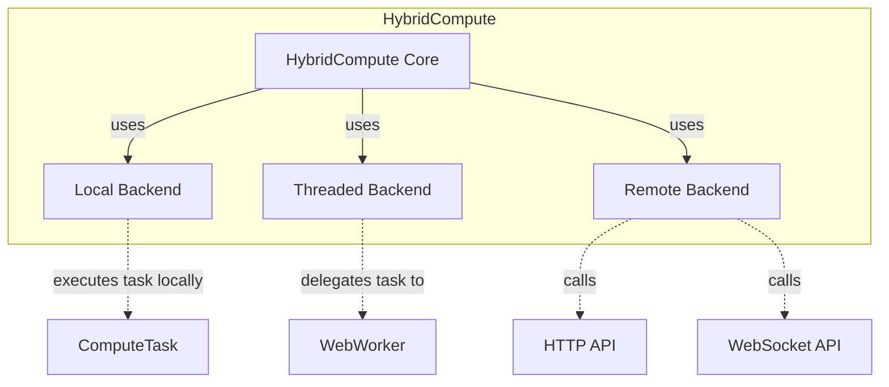
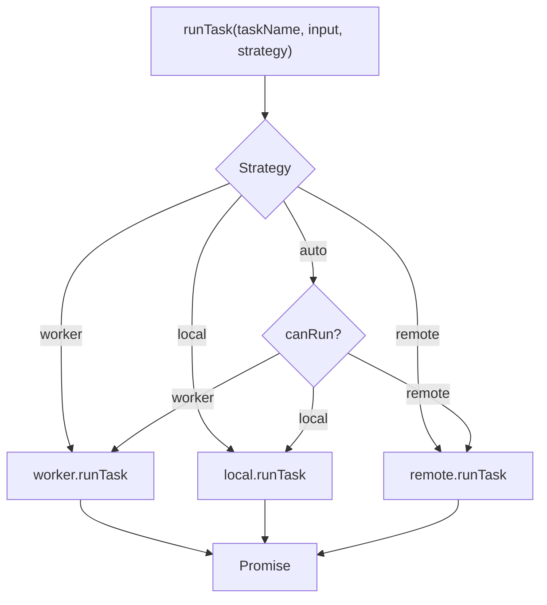
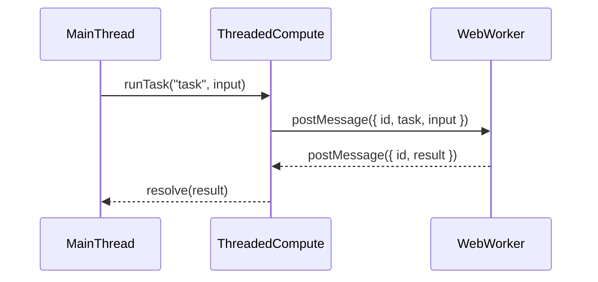
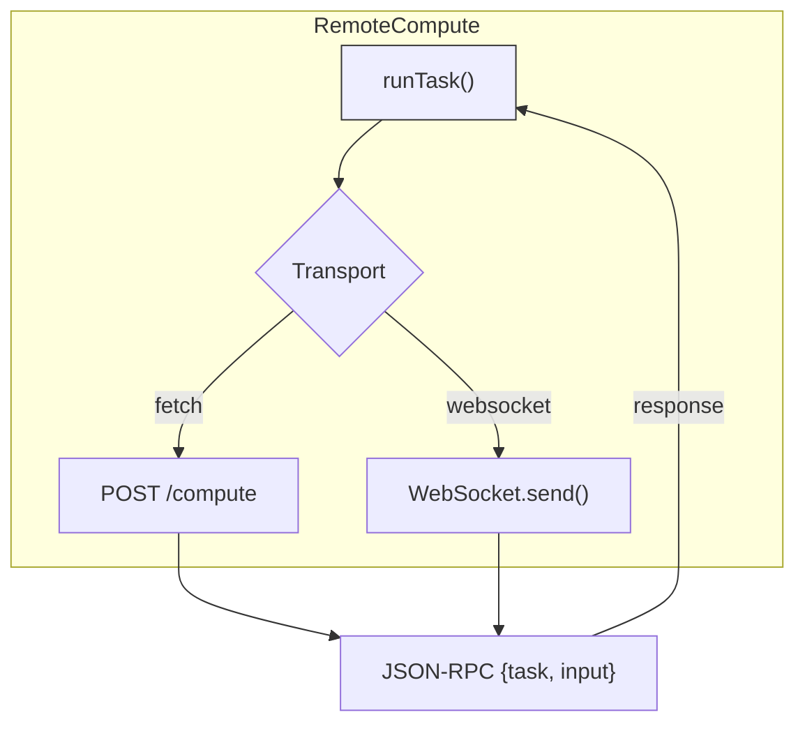

# @hybrid-compute


> **Run compute tasks wherever they run best - local, threaded, or remote - with a pluggable backend architecture.**

[](http://commitizen.github.io/cz-cli/)
[](http://makeapullrequest.com)
[](http://semver.org/spec/v2.0.0.html)


[](https://codecov.io/gh/phun-ky/hybrid-compute)
[](https://github.com/phun-ky/hybrid-compute/actions/workflows/check.yml)

## About

`@hybrid-compute` is a flexible, modular compute orchestration framework that
dispatches computational tasks to the most appropriate backend — whether that's:

- The local JS thread (for fast, simple tasks)
- A dedicated Web Worker (for multi-threaded offloading)
- Or a remote compute service over HTTP or WebSocket

All you do is define tasks and call `runTask()`. HybridCompute takes care of the
rest.

## Table of Contents<!-- omit from toc -->

- [@hybrid-compute](#hybrid-compute)
  - [About](#about)
  - [API](#api)
  - [Usage](#usage)
    - [Usage with local](#usage-with-local)
    - [Usage with remote](#usage-with-remote)
      - [Fetch](#fetch)
      - [WebSocket](#websocket)
    - [Usage with worker](#usage-with-worker)
  - [Example](#example)
  - [Visual overviews](#visual-overviews)
    - [High-Level Package Architecture](#high-level-package-architecture)
    - [Task Dispatch Flow (HybridCompute Core)](#task-dispatch-flow-hybridcompute-core)
    - [Threaded Worker Lifecycle](#threaded-worker-lifecycle)
    - [Remote Compute Flow (WebSocket or Fetch)](#remote-compute-flow-websocket-or-fetch)
  - [Development](#development)
  - [Contributing](#contributing)
  - [License](#license)
  - [Changelog](#changelog)
  - [Sponsor me](#sponsor-me)

## API

Check out the full documentation
[here](https://github.com/phun-ky/hybrid-compute/blob/main/docs/api/README.md).

Includes:

- All public classes and methods
- Task registration and execution patterns
- Transport and backend setup guides

## Usage

```shell-session
npm install @hybrid-compute/core
```

### Usage with local

```bash
npm install @hybrid-compute/core
npm install @hybrid-compute/local
```

```ts
import { createHybridCompute } from '@hybrid-compute/core';
import { createLocalCompute } from '@hybrid-compute/local';

// Define a simple echo task
const echoTask = {
  name: 'echo',
  async run(input: string): Promise<string> {
    return `Echo: ${input}`;
  }
};

// Set up the local backend and register the task
const local = createLocalCompute();
local.registerTask(echoTask);

// Set up the HybridCompute instance with only the local backend
const compute = createHybridCompute({
  local
});

// Run the task
async function main() {
  try {
    const result = await compute.runTask('echo', 'Hello from HybridCompute!');
    console.log(result); // Output: Echo: Hello from HybridCompute!
  } catch (error) {
    console.error('Task failed:', error);
  }
}

main();
```

### Usage with remote

```bash
npm install @hybrid-compute/core
npm install @hybrid-compute/remote
```

#### Fetch

```ts
import { createHybridCompute } from '@hybrid-compute/core';
import { createRemoteCompute } from '@hybrid-compute/remote';

const remote = createRemoteCompute({
  transport: 'fetch',
  endpoint: 'https://your-remote-service.com/compute',
  canRunTasks: ['echo']
});

const compute = createHybridCompute({
  remote
});

async function main() {
  try {
    const result = await compute.runTask('echo', 'Remote via fetch!');
    console.log(result); // Output from remote server
  } catch (error) {
    console.error('Task failed:', error);
  }
}

main();
```

##### Example server for the remote fetch example

```js
import express from 'express';

const app = express();
const port = 3000;

// Middleware to parse JSON
app.use(express.json());

// Dummy task implementations
const tasks = {
  echo: async (input) => {
    return `Echo from remote server: ${input}`;
  },

  // Example additional task
  reverse: async (input) => {
    if (typeof input !== 'string') throw new Error('Input must be a string');
    return input.split('').reverse().join('');
  }
};

// Route to handle compute requests
app.post('/compute', async (req, res) => {
  const { task, input } = req.body;

  try {
    if (!task || !tasks[task]) {
      throw new Error(`Unknown task '${task}'`);
    }

    const result = await tasks[task](input);
    res.json({ result });
  } catch (error) {
    res.status(400).json({ error: error.message });
  }
});

app.listen(port, () => {
  console.log(
    `🧠 RemoteCompute server listening at http://localhost:${port}/compute`
  );
});
```

This can be tested locally:

```curl
curl -X POST http://localhost:3000/compute \
  -H "Content-Type: application/json" \
  -d '{"task": "echo", "input": "hello"}'
```

#### WebSocket

```ts
import { createHybridCompute } from '@hybrid-compute/core';
import { createRemoteCompute } from '@hybrid-compute/remote';

const remote = createRemoteCompute({
  transport: 'websocket',
  endpoint: 'wss://your-remote-service.com/socket',
  canRunTasks: ['echo']
});

const compute = createHybridCompute({
  remote
});

async function main() {
  try {
    const result = await compute.runTask('echo', 'Remote via WebSocket!');
    console.log(result); // Output from remote service
  } catch (error) {
    console.error('Task failed:', error);
  }
}

main();
```

##### Example server for the remote WebSocket example

```js
import { WebSocketServer } from 'ws';
import http from 'http';

// Simple task definitions
const tasks = {
  echo: async (input) => {
    return `Echo from WebSocket server: ${input}`;
  },

  reverse: async (input) => {
    if (typeof input !== 'string') throw new Error('Input must be a string');
    return input.split('').reverse().join('');
  }
};

// Create an HTTP server to attach WebSocket
const server = http.createServer();
const wss = new WebSocketServer({ server });

wss.on('connection', (ws) => {
  ws.on('message', async (message) => {
    let request;

    try {
      request = JSON.parse(message.toString());
    } catch (err) {
      ws.send(JSON.stringify({ id: null, error: 'Invalid JSON' }));
      return;
    }

    const { id, task, input } = request;

    if (!id || typeof task !== 'string') {
      ws.send(JSON.stringify({ id, error: 'Missing or invalid task name' }));
      return;
    }

    try {
      if (!tasks[task]) throw new Error(`Unknown task '${task}'`);

      const result = await tasks[task](input);
      ws.send(JSON.stringify({ id, result }));
    } catch (error) {
      ws.send(JSON.stringify({ id, error: error.message }));
    }
  });
});

server.listen(3001, () => {
  console.log(
    '🔌 WebSocket RemoteCompute server listening at ws://localhost:3001'
  );
});
```

### Usage with worker

```bash
npm install @hybrid-compute/core
npm install @hybrid-compute/worker
```

Create a file named `worker.ts`:

```ts
self.onmessage = async (event) => {
  const { task, input, id } = event.data;

  try {
    let result;

    switch (task) {
      case 'echo':
        result = `Echo from Worker: ${input}`;
        break;

      // Add more cases for additional tasks
      default:
        throw new Error(`Unknown task: ${task}`);
    }

    self.postMessage({ id, result });
  } catch (error) {
    self.postMessage({ id, error: (error as Error).message });
  }
};
```

And your `main.ts`:

```ts
import { createHybridCompute } from '@hybrid-compute/core';
import { createThreadedCompute } from '@hybrid-compute/worker';

// Worker must be served as a module
const worker = createThreadedCompute(
  new URL('./worker.ts', import.meta.url).href,
  ['echo']
);

const compute = createHybridCompute({
  worker
});

const main = async () => {
  try {
    const result = await compute.runTask('echo', 'Hello from Worker!');
    console.log(result); // Echo from Worker: Hello from Worker!
  } catch (error) {
    console.error('Task failed:', error);
  }
};

main();
```

## Example

This example expects a task setup for `double` on the backends that doubles the
input number. `auto` is used to use first available backend that has the task
set up.

```ts
import {
  HybridCompute,
  createLocalCompute,
  createThreadedCompute,
  createRemoteCompute
} from '@hybrid-compute/core';

const compute = new HybridCompute({
  local: createLocalCompute(),
  worker: createThreadedCompute(new URL('./worker.js', import.meta.url), [
    'double'
  ]),
  remote: createRemoteCompute({ transport: 'fetch', endpoint: '/api/compute' })
});

const result = await compute.runTask<number, number>('double', 21, 'auto');
console.log(result); // 42
```

## Visual overviews

### High-Level Package Architecture



### Task Dispatch Flow (HybridCompute Core)



### Threaded Worker Lifecycle



### Remote Compute Flow (WebSocket or Fetch)



## Development

```shell-session
// Build
$ npm run build
// Test
$ npm test
```

## Contributing

Want to contribute? Please read the
[CONTRIBUTING.md](https://github.com/phun-ky/hybrid-compute/blob/main/CONTRIBUTING.md)
and
[CODE_OF_CONDUCT.md](https://github.com/phun-ky/hybrid-compute/blob/main/CODE_OF_CONDUCT.md)

## License

This project is licensed under the MIT License - see the
[LICENSE](https://github.com/phun-ky/hybrid-compute/blob/main/LICENSE) file for
details.

## Changelog

See the respective package changelogs.

## Sponsor me

I'm an Open Source evangelist, creating stuff that does not exist yet to help
get rid of secondary activities and to enhance systems already in place, be it
documentation, tools or web sites.

The sponsorship is an unique opportunity to alleviate more hours for me to
maintain my projects, create new ones and contribute to the large community
we're all part of :)

[Support me on GitHub Sponsors](https://github.com/sponsors/phun-ky).

p.s. **Ukraine is still under brutal Russian invasion. A lot of Ukrainian people
are hurt, without shelter and need help**. You can help in various ways, for
instance, directly helping refugees, spreading awareness, putting pressure on
your local government or companies. You can also support Ukraine by donating
e.g. to [Red Cross](https://www.icrc.org/en/donate/ukraine),
[Ukraine humanitarian organisation](https://savelife.in.ua/en/donate-en/#donate-army-card-weekly)
or
[donate Ambulances for Ukraine](https://www.gofundme.com/f/help-to-save-the-lives-of-civilians-in-a-war-zone).
