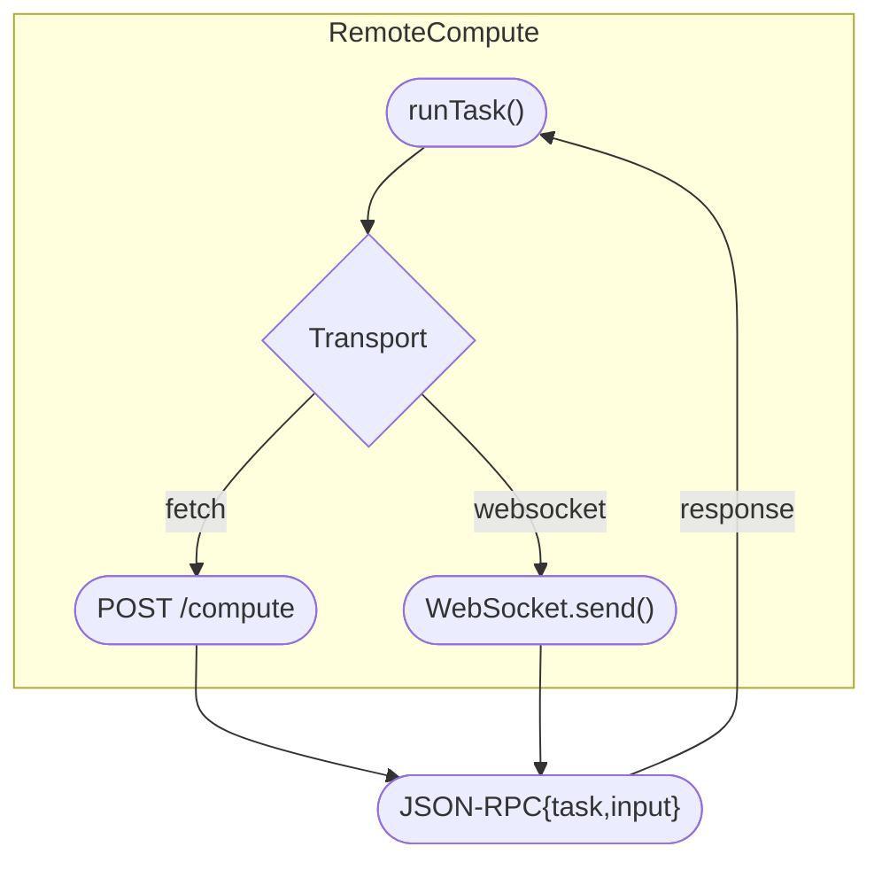

# About Hybrid Compute

**Hybrid Comppute** is a flexible, modular compute orchestration framework that
dispatches computational tasks to the most appropriate backend - whether that's:

- The local JS thread (for fast, simple tasks)
- A dedicated Web Worker (for multi-threaded offloading)
- Or a remote compute service over HTTP or WebSocket

All you do is define tasks and call `runTask()`. **Hybrid-Compute** takes care
of the rest.

[[toc]]

## Use Cases

### Low-Latency UI, Zero Jank

| **Problem:**                                     | **Solution:**                                                                                                                | **Backends:**                            |
| ------------------------------------------------ | ---------------------------------------------------------------------------------------------------------------------------- | ---------------------------------------- |
| Heavy logic blocks the main thread and hurts UX. | Run cheap, synchronous logic **locally**, push CPU-intensive work to a **Web Worker**, and only call **remote** when needed. | `local` → `worker` → `remote` (fallback) |

::: tip **Why use Hybrid-Compute?**

`auto` strategy + `canRun` lets you route without if/else sprawl.

:::

### Heavy Data Crunching (CSV/JSON/Parquet)

| **Problem:**                                                           | **Solution:**                                                                       | **Backends:**                 |
| ---------------------------------------------------------------------- | ----------------------------------------------------------------------------------- | ----------------------------- |
| Large file parsing/transformations freeze the UI or time out remotely. | Parse/transform in a **worker**; optionally batch and upload results to **remote**. | `worker`, optionally `remote` |

::: tip **Why use Hybrid-Compute?**

Clean separation of CPU work (worker) and I/O (remote).

:::

### AI Prompt Pre/Post-Processing

| **Problem:**                                                        | **Solution:**                                                                                                 | **Backends:**     |
| ------------------------------------------------------------------- | ------------------------------------------------------------------------------------------------------------- | ----------------- |
| Prompts and responses need cleaning, schema checks, and formatting. | **Local** rules/regex/JSON validation; **worker** for token post-processing (e.g., markdown/HTML transforms). | `local`, `worker` |

::: tip **Why use Hybrid-Compute?**

Keep trivial logic at the edge; save LLM quota and latency.

:::

### Token Streaming & Live Rendering

| **Problem:**                                             | **Solution:**                                                                                                   | **Backends:**                     |
| -------------------------------------------------------- | --------------------------------------------------------------------------------------------------------------- | --------------------------------- |
| You want live UI updates while the model streams tokens. | Use **remote** (WebSocket) to stream, **worker** to aggregate/refine chunks, **local** to render progressively. | `remote(ws)` + `worker` + `local` |

::: tip **Why use Hybrid-Compute?**

Each stage runs where it's best; a single `runTask` call coordinates it.

:::

### Hybrid Agent Tooling (LLM "tools")

| **Problem:**                                                  | **Solution:**                                                                                                          | **Backends:**               |
| ------------------------------------------------------------- | ---------------------------------------------------------------------------------------------------------------------- | --------------------------- |
| Agents need diverse tools (local utilities, remote services). | Register tools as **tasks** across backends. Quick utilities **local**, CPU/IO-heavy **worker**, SaaS APIs **remote**. | `local`, `worker`, `remote` |

::: tip **Why use Hybrid-Compute?**

Tools become portable tasks with uniform invocation.

:::

### Media & Numeric Processing (WASM Ready)

| **Problem:**                                               | **Solution:**                                                                                                          | **Backends:**                        |
| ---------------------------------------------------------- | ---------------------------------------------------------------------------------------------------------------------- | ------------------------------------ |
| Images/vectors/audio transforms must be fast and portable. | Use **WASM** (planned backend) in **worker** or **local** for native-like speed; **remote** only for large/batch jobs. | `wasm` (planned), `worker`, `remote` |

::: tip **Why use Hybrid-Compute?**

Swap implementations without changing call sites.

:::

### Offline-First & Flaky Networks

| **Problem:**                      | **Solution:**                                                                        | **Backends:**               |
| --------------------------------- | ------------------------------------------------------------------------------------ | --------------------------- |
| Users lose connectivity mid-task. | Run **local/worker** first; queue results and reconcile with **remote** when online. | `local`, `worker`, `remote` |

::: tip **Why use Hybrid-Compute?**

`auto` + capability checks enable graceful degradation.

:::

### Cost-Aware Routing

| **Problem:**                                                        | **Solution:**                                                                                            | **Backends:**               |
| ------------------------------------------------------------------- | -------------------------------------------------------------------------------------------------------- | --------------------------- |
| Cloud compute is expensive; not all work needs a server round-trip. | Prefer **local/worker** for pre-processing and summarization; call **remote** only for high-value tasks. | `local`, `worker`, `remote` |

::: tip **Why use Hybrid-Compute?**

Centralized routing policy; easy A/B on strategy.

:::

### Compliance & Data Locality

| **Problem:**                                         | **Solution:**                                                               | **Backends:**                  |
| ---------------------------------------------------- | --------------------------------------------------------------------------- | ------------------------------ |
| PII/regulated data must not leave the device/region. | Hash/aggregate/filter **locally**; send only safe aggregates to **remote**. | `local` (guard rail), `remote` |

::: tip **Why use Hybrid-Compute?**

Task boundaries become privacy boundaries.

:::

### Progressive Enhancement

| **Problem:**                                  | **Solution:**                                                                                  | **Backends:**                 |
| --------------------------------------------- | ---------------------------------------------------------------------------------------------- | ----------------------------- |
| Users' devices differ widely in capabilities. | Try **worker**; if unsupported, run **local**; if still insufficient, fall back to **remote**. | `worker` → `local` → `remote` |

::: tip **Why use Hybrid-Compute?**

The same `runTask` call adapts to the environment.

:::

### Multi-Tenant & Edge Offload

| **Problem:**                                           | **Solution:**                                                               | **Backends:**                         |
| ------------------------------------------------------ | --------------------------------------------------------------------------- | ------------------------------------- |
| You want tenant-isolated compute or edge acceleration. | Route to nearest **remote** region; keep light transforms **local/worker**. | `local`, `worker`, `remote(fetch/ws)` |

::: tip **Why use Hybrid-Compute?**

Pluggable transports (HTTP/WS) and per-tenant endpoints.

:::

### Testability & Observability

| **Problem:**                         | **Solution:**                                                                         | **Backends:**  |
| ------------------------------------ | ------------------------------------------------------------------------------------- | -------------- |
| It's hard to test distributed logic. | Swap in a **mock local** backend during tests; assert routing decisions and payloads. | `local` (mock) |

::: tip **Why use Hybrid-Compute?**

Backends are interfaces; DI by design.

:::

## Visual overviews

### High-Level Package Architecture

**Hybrid-Compute** Core is the orchestration layer. It doesn't execute work
itself; it routes tasks to whichever backend is available and appropriate. The
Local backend runs tasks on the main JS thread for minimal overhead, the Worker
backend offloads work to a Web Worker to keep the UI responsive, and the Remote
backend calls out to a server over HTTP or WebSocket. Each backend is pluggable
and can be added or omitted depending on your deployment needs.

### Task Dispatch Flow (@hybrid-compute/core)

`runTask(taskName, input, strategy)` accepts a **routing strategy**. If you pass
`local`, `worker`, or `remote`, the call is dispatched directly to that backend.
With `auto`, **Hybrid-Compute** checks backend **capabilities** (i.e., whether a
backend can run the named task) and selects one accordingly. In the diagram, the
**fallback order** for `auto` is `worker → local → remote`. No matter which
backend runs the work, you always get a `Promise<Output>` and a consistent error
surface if no backend can handle the task.

### Threaded Worker Lifecycle (@hybrid-compute/worker)

When the Worker backend is selected, **Hybrid-Compute** packages your request
and posts a message to the Web Worker with `{ id, task, input }`. The worker
performs the computation and posts back `{ id, result }` (or `{ id, error }`).
The Worker backend then resolves the original promise on the main thread. This
separation keeps heavy computations off the UI thread while preserving a simple,
promise-based API.

### Remote Compute Flow (@hybrid-compute/remote)

The Remote backend abstracts transport details behind the same `runTask()` call.
For Fetch, it sends a `POST /compute` with JSON `{ task, input }` and resolves
with the server's `{ result }` (or surfaces `{ error }`). For WebSocket, it
sends `{ id, task, input }` and correlates responses `{ id, result|error }` to
the originating request. In both cases, the Remote backend normalizes responses
so the calling code doesn't care how the work was transported, only that it
completed successfully.

## Developer Experience

**Hybrid Compute** is a ESM package, served through
[npm](https://www.npmjs.com/).

It is Open Source, and easy to use.
